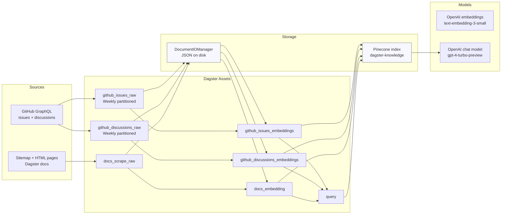

# Ask AI Dagster

> A production-grade RAG knowledge base for Dagster documentation and community content, orchestrated with Dagster

[](https://www.python.org/downloads/)
[](https://dagster.io/)
[](https://openai.com/)
[](https://www.pinecone.io/)

## Overview

This project demonstrates a **production-minded Retrieval-Augmented Generation (RAG) system** using **Dagster** for orchestration. It continuously builds a searchable knowledge base from multiple sources and answers questions using semantic search and LLM generation.

**Data sources:**
- Dagster documentation (web scraping via sitemap)
- Dagster GitHub repository (issues + discussions via GraphQL API)

**Stack:**
- **Orchestration**: Dagster (asset-based pipelines, partitioning, scheduling)
- **Vector store**: Pinecone (semantic search with namespaces)
- **Embeddings**: OpenAI `text-embedding-3-small`
- **Generation**: OpenAI `gpt-4-turbo-preview`

## What this project showcases (design + engineering)

- **Orchestration & reliability**: assets, dependencies, partitioning, scheduling/automation conditions, and reproducible runs.
- **Data modeling**: normalizing heterogeneous sources (docs + GitHub) into a shared `Document` schema.
- **Vector search design**: namespace strategy, metadata strategy, and index lifecycle management.
- **Cost + latency awareness**: batch embeddings, rate limiting, and incremental processing via weekly partitions.
- **Systems thinking**: explicit tradeoffs, failure modes, and next-step improvements (see below).

## Architecture (high level)



## End-to-end flow

### 1) Ingestion (raw documents)
- **GitHub issues** are fetched weekly using a **weekly partition** so each run processes a bounded time window.
- **GitHub discussions** are fetched weekly with the same partitioning strategy.
- **Docs** are scraped from a sitemap, HTML is cleaned, and the content is stored as `Document` objects.

### 2) Embeddings + indexing (vector store)
- Raw `Document` objects are embedded with OpenAI’s **`text-embedding-3-small`**.
- Vectors are upserted into Pinecone index **`dagster-knowledge`** using namespaces:
  - `dagster-docs` for docs embeddings
  - `dagster-github` for GitHub issues/discussions embeddings

### 3) Retrieval + generation
- A user question is embedded.
- The system queries Pinecone across both namespaces, ranks matches by similarity, and builds a prompt from retrieved context.
- The chat model generates an answer with **sources metadata** returned for transparency.

## Design thinking & tradeoffs

### Why Dagster?
Dagster gives this RAG system “data product” characteristics:
- **Lineage**: clear upstream/downstream asset relationships.
- **Reproducibility**: rerun specific partitions (e.g. a specific week of GitHub content).
- **Observability hooks**: structured logs, materialization metadata, and failure visibility.
- **Incrementality**: partitioned ingestion reduces reprocessing and cost.

### Partitioning strategy (weekly)
I chose weekly partitions for GitHub because:
- It keeps runs deterministic and bounded (nice for retries + backfills).
- It reduces embedding costs by updating only “new/changed” content.
- It enables later tuning (e.g. daily for freshness, monthly for cost).

### Storage strategy (IO manager + Pinecone)
- **Local JSON persistence** via a custom `DocumentIOManager` makes raw documents inspectable and debuggable.
- **Pinecone** provides scalable semantic search over a unified index with namespaces separating source domains.

### Metadata strategy (for debugging + UX)
Each vector includes metadata like title/source/url/created_at where available so the UI/consumer can:
- show citations
- understand where an answer came from
- debug retrieval quality

### Known gaps / next improvements
If I were hardening this further, I would:
- **Store the retrieved text explicitly** in Pinecone metadata (or store chunk IDs and fetch text from a document store) so prompts always include meaningful context.
- Add **deduplication and stable vector IDs** (currently some IDs are sequential per run).
- Add **evaluation**: retrieval hit-rate and answer quality tests (golden Q/A set).
- Add **indexing policies**: TTL / re-embedding strategy when models change.
- Add **document chunking** for GitHub content (docs are chunked; GitHub currently embeds whole documents).

## Project structure

Key modules:
- `src/ask_ai_dagster/defs/assets/ingestion.py`: ingestion + embedding assets for GitHub + docs
- `src/ask_ai_dagster/defs/assets/retrieval.py`: `query` asset (retrieval + generation)
- `src/ask_ai_dagster/defs/resources/*`: GitHub, scraper, Pinecone, OpenAI resources
- `src/ask_ai_dagster/defs/io_managers.py`: `DocumentIOManager` (writes/reads documents as JSON)

## Getting started

### Prereqs
- Python 3.10+
- A Pinecone project
- OpenAI API key
- GitHub token (for GraphQL API access)

### Environment variables

Set these (example):

```bash
export GITHUB_TOKEN="..."
export OPENAI_API_KEY="..."
export PINECONE_API_KEY="..."
export SITEMAP_URL="https://docs.dagster.io/sitemap.xml"
```

### Installing dependencies

**Option 1: uv**

Ensure [`uv`](https://docs.astral.sh/uv/) is installed following their [official documentation](https://docs.astral.sh/uv/getting-started/installation/).

```bash
uv sync
```

Activate the virtual environment:

| OS | Command |
| --- | --- |
| MacOS | `source .venv/bin/activate` |
| Windows | `.venv\Scripts\activate` |

**Option 2: pip**

```bash
python3 -m venv .venv
source .venv/bin/activate
pip install -e ".[dev]"
```

### Running Dagster

Start the Dagster UI web server:

```bash
dg dev
```

Then open `http://localhost:3000`.

## Operating notes (how to use it)

### Materialize the knowledge base
In the Dagster UI, materialize (in order or as a group):
- `github_issues_raw` → `github_issues_embeddings`
- `github_discussions_raw` → `github_discussions_embeddings`
- `docs_scrape_raw` → `docs_embedding`

Because GitHub ingestion is **weekly-partitioned**, pick at least one partition to populate the index.

### Ask a question
Materialize the `query` asset with config:

```yaml
ops:
  query:
    config:
      question: "What is Dagster?"
```

The materialization metadata includes the generated answer and source snippets/URLs (when available).

## Learn more

- [Dagster Documentation](https://docs.dagster.io/)
- [Dagster University](https://courses.dagster.io/)
- [Dagster Slack Community](https://dagster.io/slack)
